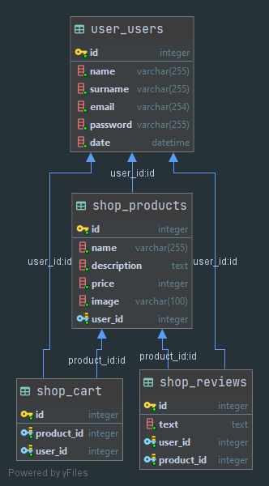

# Проект базы данных ломбарда


## Запуск
1. ```docker run -ti --rm -p 8000:8000 docker.pkg.github.com/designdeveloperr/pawnshop/pawnshop:latest```
2. Открыть http://localhost:8000

## Альтернативный способ
1. `source venv/Scripts/activate`
2. `./manage.py runserver 8000`
3. Открыть http://localhost:8000

